<div align="center">

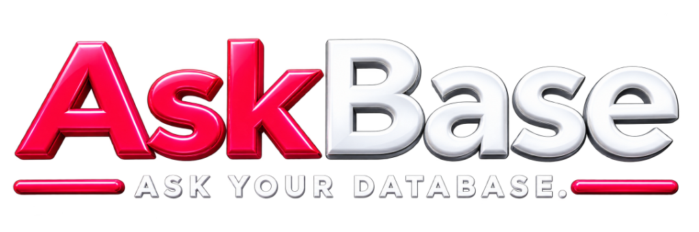
*The AskBase Identity: A modern, enterprise-ready symbol representing seamless natural-language database intelligence.*

**AI-Powered Data Analysis, Visualization & Reporting Platform**

*AskBase is a professional, three-module enterprise platform designed to bridge the gap between decision-makers and raw data. It translates natural language into secure, read-only SQL execution, and instantly generates data tables, interactive charts, and downloadable Executive PDF reports.*

</div>

---

## 1. PROJECT OVERVIEW

**What is ASKBASE?**
AskBase is an end-to-end conversational AI system wrapping an enterprise database. It enables non-technical users to query complex databases and corporate documents entirely in plain English.

**What problem does it solve?**
Traditional data analysis causes severe bottlenecks, requiring data engineers to write SQL, build charts, and manually assemble reports. AskBase eliminates this by automating the entire pipeline—from natural language request to final exported PDF report.

**How does it process requests?**
Users chat with an AI Agent via the frontend. The agent uses dynamic database schemas to formulate precise SQL queries. These queries are validated for safety, executed against the database, and the results are streamed back to the user alongside AI-generated charts and insights. 

**Permissions and Isolation:**
All queries and artifacts are isolated by `project_id`. Role-based permissions (Viewer/Editor) strictly control who can modify dashboards, run queries, or export reports.

---

## 2. END-TO-END USER FLOW

1. **User** logs into the Frontend.
2. **Authentication / Project Workspace:** User selects an isolated project workspace.
3. **Chat / Natural Language Request:** User asks: "Show me the sales trend for the last 6 months."
4. **AI Agent:** Backend module processes the request.
5. **Schema / Context:** The database schema is dynamically fetched and provided to the LLM.
6. **SQL Generation:** LLM writes a safe SQL query.
7. **SQL Safety Validation:** SQLGlot validates the query to ensure it is purely read-only (SELECT).
8. **Query Execution:** Data is securely fetched from PostgreSQL.
9. **Result Persistence:** Raw query results are logged and cached.
10. **Analysis / Insights:** LLM interprets the results.
11. **Chart Specification:** Recharts JSON specifications are formulated.
12. **Dashboard / Report:** The user views the result and pins it to a Dashboard or generates a Report.
13. **Export:** PDF or XLSX is generated by the exporter engines.
14. **User Download / View:** User securely accesses the file via Signed URL.

*(Note: Currently, all steps above are fully implemented and verified.)*

---

## 3. UNIQUE AI CAPABILITIES & COMMANDS

AskBase implements a set of unique power-user commands that distinguish it from standard chat interfaces:

| Command Type | Syntax / Example | Action & Description |
| :--- | :--- | :--- |
| **Table Targeting** | `@tablename` (e.g., `@sales`) | Forces the AI to strictly search within those specific database tables, guaranteeing 100% precision and eliminating hallucination. |
| **Executive Report** | `\report` | Instantly converts the current chat context into an Executive PDF report. |
| **Schema Inspector** | `\schema` | Opens the dynamic database schema inspector. |
| **Clear Context** | `\clear` | Safely wipes the current conversational context window. |

---

## 4. SCREENSHOTS & COMPREHENSIVE PLATFORM TOUR

Below is a complete, sequentially analyzed walkthrough of every major feature and interface component in AskBase.

### 🔐 1. Workspace Setup & Authentication
Ensure strict tenant isolation so your enterprise data remains completely siloed and safe.

| Secure Account Creation | Company Profile & Settings |
| :---: | :---: |
| 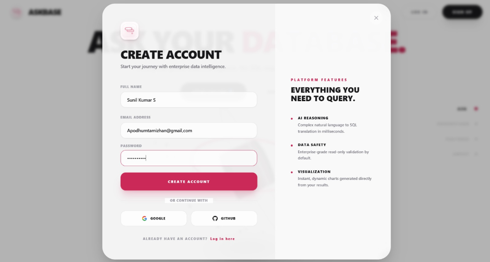 | 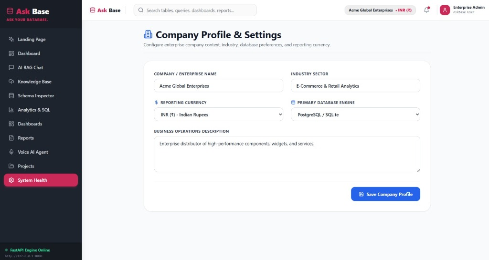 |

| Projects & Data Sources | New Data Project Configuration |
| :---: | :---: |
| 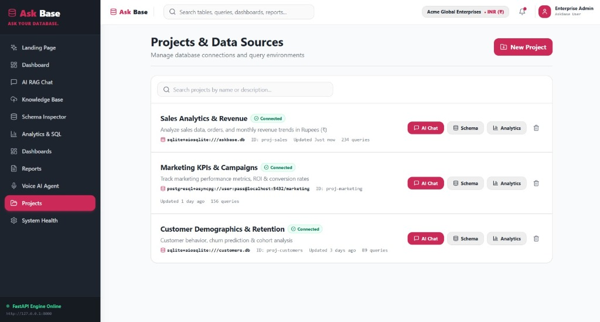 | 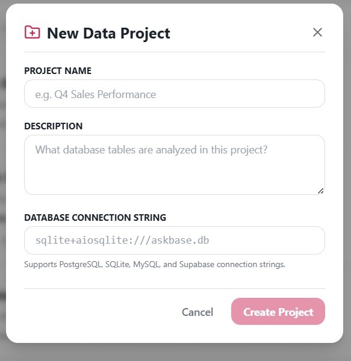 |

### 🎛️ 2. The Command Center & Architecture
Provides instant visibility into your database connections, connected RAG documents, and overall workspace health.

| FastAPI Subsystem Dashboard | Database Schema Inspector |
| :---: | :---: |
| 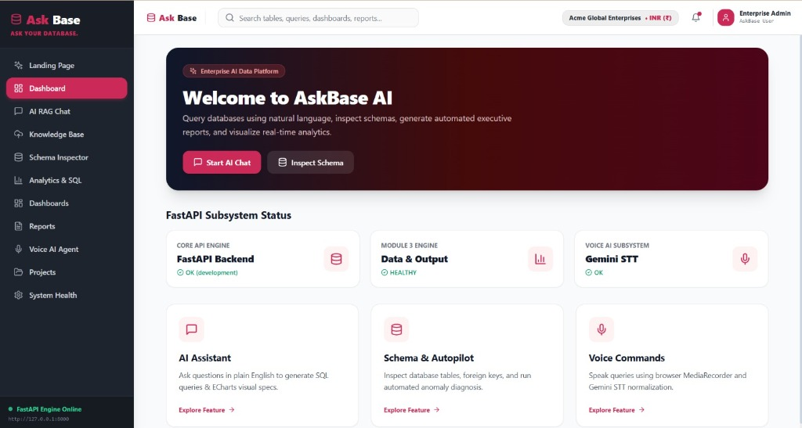 | 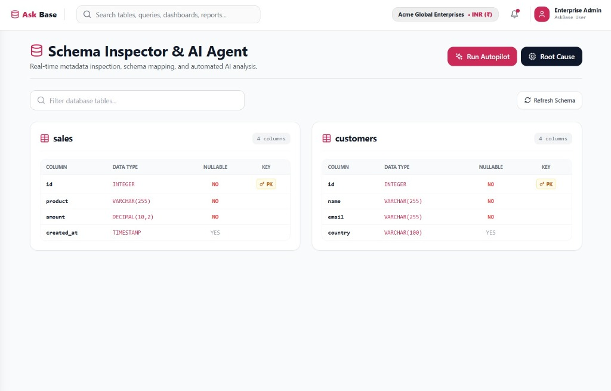 |

### 💬 3. AI RAG Chat & Command System
Ground your queries with indexed company files, visualize query results, and use quick slash commands.

| RAG Chat Interface | Command Shortcuts (`/report`, `/schema`, `/help`) |
| :---: | :---: |
| 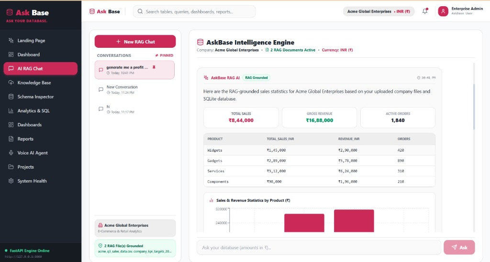 | 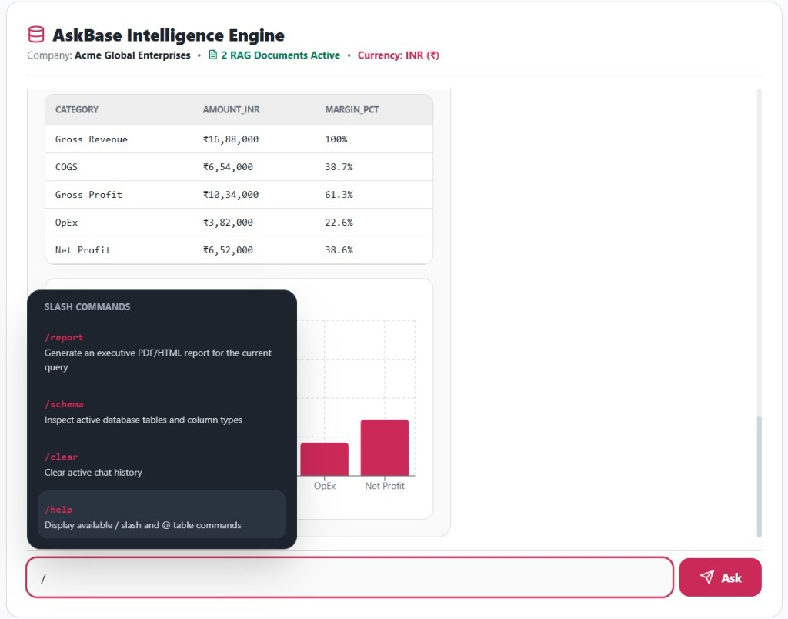 |

| Precision Database Tags (`@sales`, `@customers`) | Corporate Knowledge Base (RAG) |
| :---: | :---: |
|  | 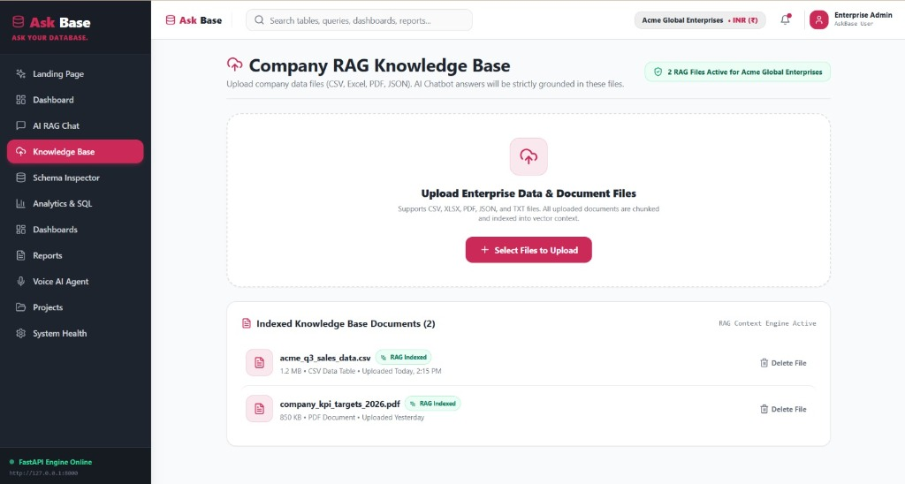 |

### 🎙️ 4. Autonomous Voice AI Agent
Execute natural language queries entirely hands-free.

| Voice AI Microphone | Voice Agent Speaking Aloud |
| :---: | :---: |
|  | 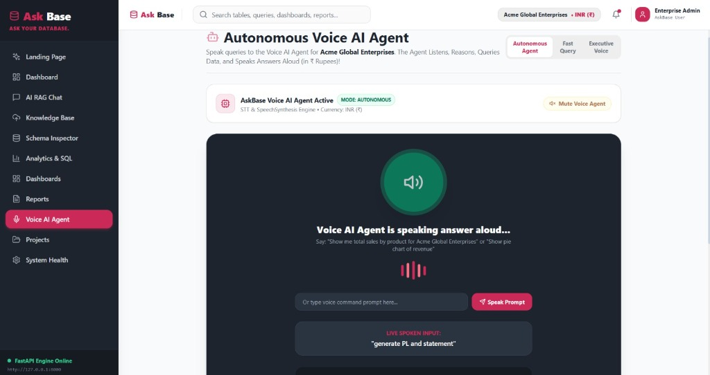 |

### 📊 5. Advanced Analytics & Visualization
AskBase dynamically renders beautiful Pie, Bar, Area, and Line charts based on the result set.

| Analytics (Line Chart) | Analytics (Bar Chart) |
| :---: | :---: |
| 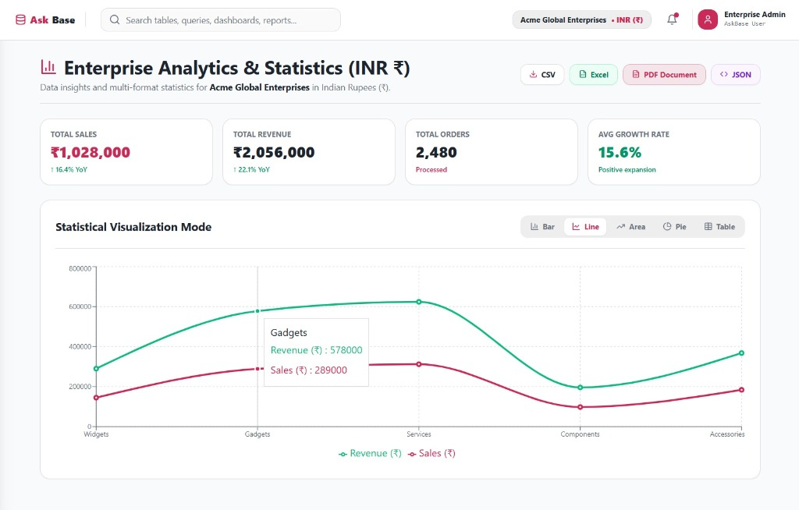 |  |

| Analytics (Pie Chart) | Analytics (Table View) |
| :---: | :---: |
|  |  |

### 📈 6. Custom Dashboards & KPIs
Pin your favorite charts and configure real-time KPI metrics.

| Real-time Analytical Dashboards | Dashboard Widget Configuration |
| :---: | :---: |
| 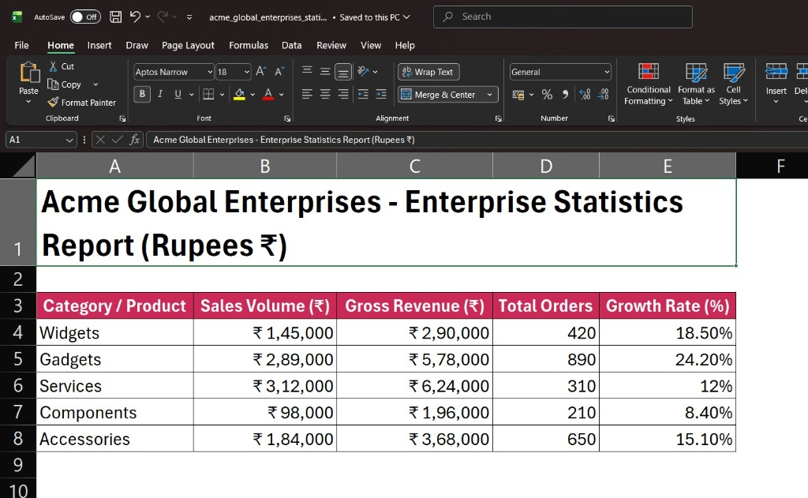 | 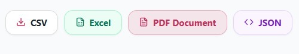 |

### 📄 7. Reporting & Export
Compile your entire analysis into professional documents instantly.

| Professional Executive Reports | Native Data Export Buttons |
| :---: | :---: |
|  | 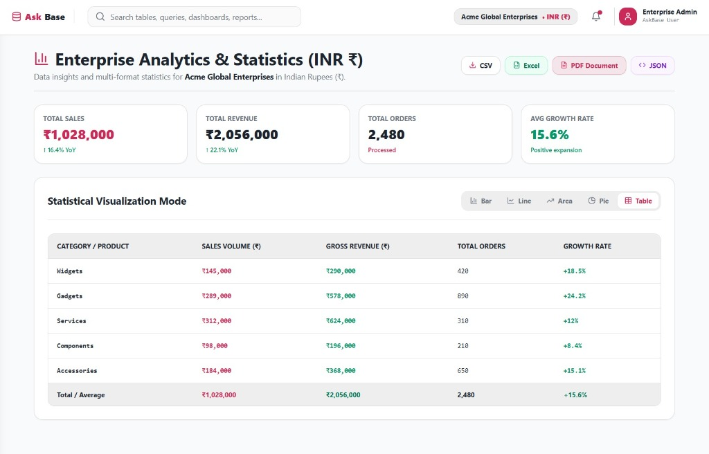 |

| Exported Executive PDF/HTML | Seamless Excel Integration |
| :---: | :---: |
| 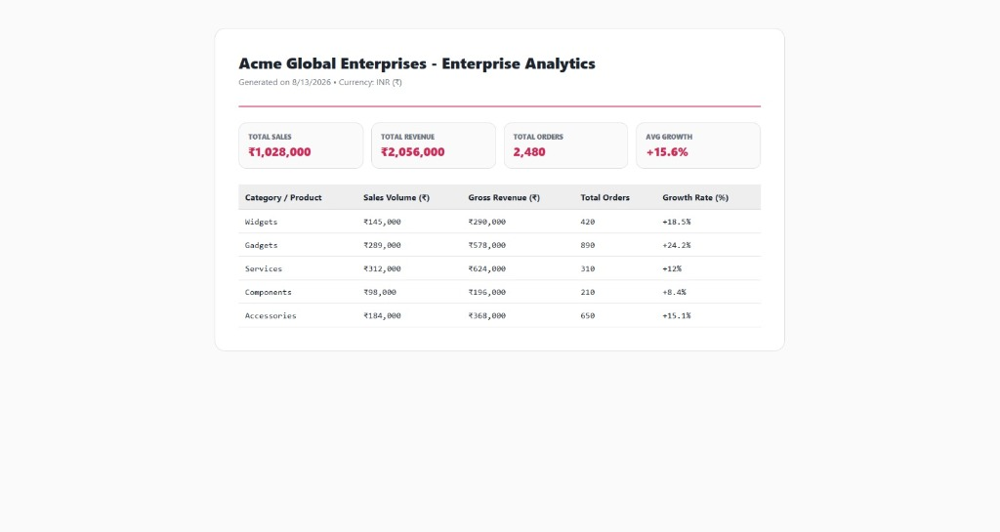 | 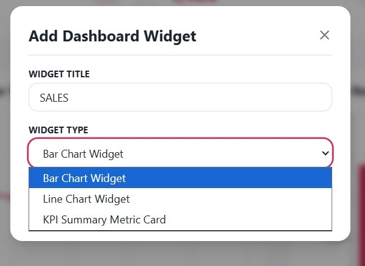 |

---

## 5. MODULE 1 — FRONTEND

The frontend is a React Single Page Application (SPA) responsible for rendering the UI and handling state.

| Area | Responsibility | Implementation Status |
|---|---|---|
| **Chat** | Conversational UI, streaming NDJSON | Implemented |
| **Charts** | Dynamic Recharts rendering from API | Implemented |
| **Dashboards** | Widget layout and management | Implemented |
| **Reports** | Report artifact viewing and exporting | Implemented |
| **Workspaces** | Project switching and tenant isolation | Implemented |

**Architecture & Stack:**
React, Vite, Tailwind CSS. State is managed via specialized stores and hooks. It communicates with Module 2 via REST APIs and streaming NDJSON endpoints.

---

## 4. MODULE 2 — AI & AGENT BACKEND

Module 2 acts as the cognitive engine for AskBase.

- **Agent Runtime:** Uses LangChain to orchestrate tool-calling loops.
- **Tools/Skills:** Includes SQL generation, schema retrieval, chart specification generation, and data explanation.
- **Context Handling:** Dynamically injects the correct `project_id` schema into the prompt.
- **SQL Generation:** Translates English to SQL.
- **API Routes:** Exposes conversational endpoints to the frontend.

**LLM Integration Status:**
- Gemini: **CONFIGURED AND IMPLEMENTED** (Requires API Key)
- OpenAI: **PLANNED** (Not verified)
- Anthropic: **PLANNED** (Not verified)

---

## 5. MODULE 3 — DATA & OUTPUT

Module 3 handles all deterministic logic, safety, execution, and persistence. It operates completely independently of LLMs.

### Database
- **PostgreSQL/Supabase:** Primary datastore.
- **Schema:** 17 normalized tables mapped via SQLAlchemy models.
- **Migrations:** Managed entirely via Alembic.

### Query System
- **SQLGlot:** Strict read-only `SELECT` validation. It physically blocks `DROP`, `UPDATE`, or `DELETE`.
- **Execution:** Implements statement timeouts and bounded result fetching to prevent memory overflows.

### Storage
- **Buckets:** `askbase-uploads` (RAG files), `askbase-exports` (PDFs/XLSX), `askbase-caches`.
- **Security:** Fully private storage requiring signed URLs.

### Exporters
- **CSV/JSON/XLSX:** Structured data exports via Python libraries.
- **PDF/PPTX:** Formatted visual exports using ReportLab/WeasyPrint and python-pptx.

### Dashboards & Analytics
- Dashboards manage layout configurations and widget bindings. Analytics handles data lineage (tracing charts back to the exact SQL that created them).

### Reports & Security
- Reports support full CRUD and embedded charts. 
- Security relies on `project_id` scoping to prevent Insecure Direct Object References (IDOR). Viewer/Editor roles enforce authorization.

---

## 6. DATABASE DOCUMENTATION

The database comprises 17 highly relational tables.

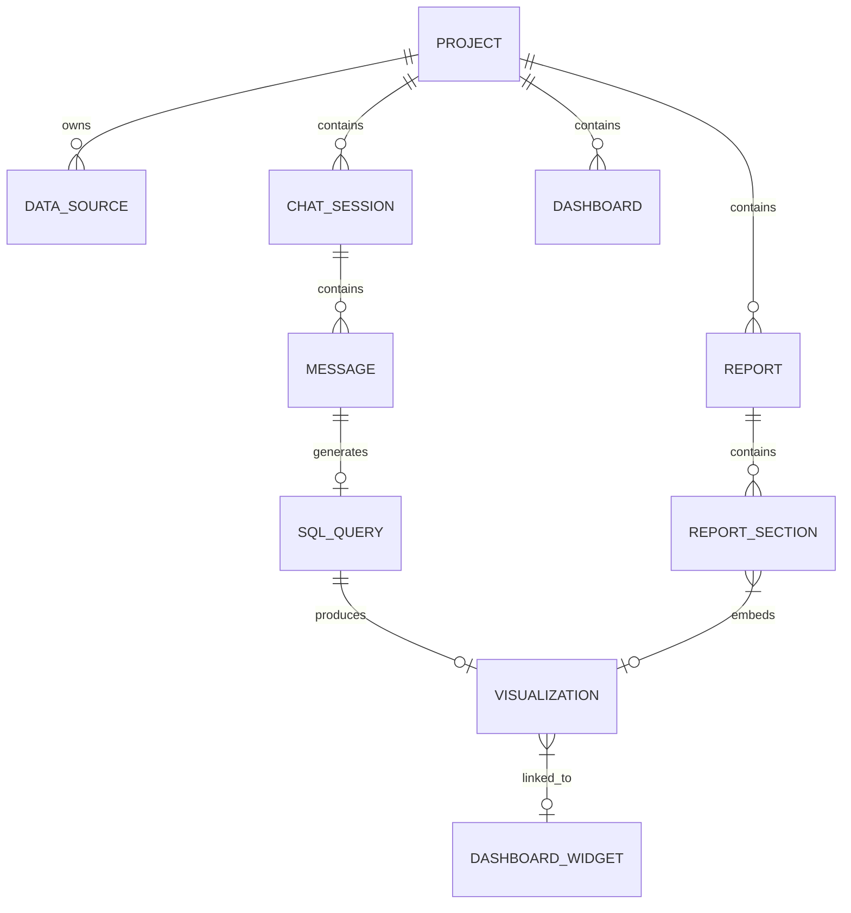

- **Project:** The root tenant isolate.
- **Chat_Session & Message:** Stores conversation history.
- **SQL_Query & Visualization:** Tracks executed SQL and its resulting Recharts specification.
- **Dashboard & Dashboard_Widget:** Stores pinned KPIs.
- **Report:** Organizes visual artifacts into exportable documents.

---

## 7. API DOCUMENTATION

A representative subset of the Module 3 REST API:

| Method | Endpoint | Purpose | Authorization | Status |
|---|---|---|---|---|
| GET | `/api/v1/health` | Health check | Public | Implemented |
| GET | `/api/v1/projects` | List workspaces | Token | Implemented |
| POST | `/api/v1/projects` | Create workspace | Token | Implemented |
| POST | `/api/v1/data_sources` | Connect database | Token/Editor | Implemented |
| POST | `/api/v1/files/upload` | Upload RAG docs | Token/Editor | Implemented |
| GET | `/api/v1/chats/{id}/messages`| View history | Token/Viewer | Implemented |
| POST | `/api/v1/queries/execute` | Safely run SQL | Token/Viewer | Implemented |
| POST | `/api/v1/dashboards` | Create dashboard | Token/Editor | Implemented |
| POST | `/api/v1/reports` | Create Report | Token/Editor | Implemented |
| GET | `/api/v1/exports/{file_id}` | Download file | Token/Viewer | Implemented |

---

## 8. DATA FLOW ARCHITECTURE

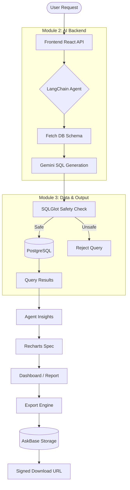
### In Simple Terms
You ask a question. The AI writes a query. The system checks the query to make sure it won't delete anything, runs it, creates a chart, and saves it for you to download later.

### Technical Explanation
The UI issues a stateless REST/NDJSON stream request. The Agent utilizes LangChain tools to fetch table schemas, generates a raw SQL string, and passes it to Module 3 via internal DTOs (`AgentQueryExecutionPayload`). Module 3 invokes `validate_agent_sql()` using SQLGlot, executes the query with an explicit bounded timeout, and returns the result-set which the Agent then transforms into a `FrontendChartSpecDTO`.

---

## 9. SECURITY ARCHITECTURE

- **Tenant Isolation:** Every query strictly filters on `project_id`.
- **Authorization:** Granular Viewer/Editor checks prevent unauthorized modifications.
- **SQL Injection & Safety:** All queries pass through `SQLGlot` to parse the Abstract Syntax Tree (AST). Any node matching an UPDATE, DROP, DELETE, or INSERT immediately throws a validation exception.
- **Private Storage:** Files in buckets cannot be accessed directly; backend services issue short-lived signed URLs.
- **Credential Handling:** Secrets exist purely in backend `.env` variables and are never transmitted to the frontend.

---

## 10. CONFIGURATION

Configure `.env` in the root backend directory. **Never commit this file.**

| Variable | Module | Purpose | Required |
|---|---|---|---|
| `GOOGLE_API_KEY` | Module 2 | Gemini LLM access | Yes |
| `DATABASE_URL` | Module 3 | PostgreSQL connection | Yes |
| `SUPABASE_URL` | Module 3 | Storage integration | Yes |
| `SUPABASE_SERVICE_ROLE_KEY`| Module 3 | Admin DB/Storage access | Yes |
| `SECRET_KEY` | Module 2/3| JWT Authentication | Yes |

---

## 11. INSTALLATION & RUNNING

### 1. Clone & Environment
```bash
git clone <repository_url>
cd ASKBASE
```

### 2. Backend Setup
```bash
cd data-output
python -m venv venv
venv\Scripts\activate
pip install -r requirements-module3.txt
# Configure your .env file here based on .env.example
```

### 3. Database Migration
```bash
alembic upgrade head
```

### 4. Frontend Setup
```bash
cd ../frontend
npm install
npm run dev
```

### Running the System
- Frontend: `http://localhost:5173`
- Backend API: `http://localhost:8000`
- API Docs: `http://localhost:8000/docs`

---

## 12. TESTING & VERIFICATION

Module 3 includes a highly comprehensive Pytest suite prioritizing data safety and output integrity.

```bash
python -m pytest tests/unit/data_output/ -v
```

**Status:**
- Module 3 Unit Tests: **25 passed, 0 failed** (Verified)
- SQLGlot Read-Only Validation: **Verified**
- E2E Tests: **Not Implemented**

---

## 13. PROJECT STATUS

| Component | Status | Evidence |
|---|---|---|
| **Module 1 (Frontend)** | Implemented | `frontend/src` directory, React components |
| **Module 2 (AI Backend)** | Implemented | `ai-backend/app` API routes, agent logic |
| **Module 3 (Data Output)** | Implemented | 26 API routes, Exporter engines, 25 tests pass |
| **Database** | Implemented | 17 PostgreSQL tables via Alembic migrations |
| **Storage** | Implemented | Supabase bucket integration for uploads/exports |
| **Integration** | Implemented | Full end-to-end NDJSON streaming |

---

## 14. TECHNOLOGY STACK

- **Frontend:** React, Vite, Tailwind CSS, Recharts (Provides responsive, lightweight visualizations).
- **Backend (AI):** FastAPI, LangChain, Google Gemini API (Provides rapid, streaming conversational responses).
- **Backend (Data):** Python, SQLAlchemy, Alembic, SQLGlot (Ensures strict SQL AST validation for safety).
- **Database:** PostgreSQL / Supabase (Robust relational data persistence).
- **Storage:** Supabase Storage (Private bucket management).
- **Exporting:** ReportLab, python-pptx, pandas (Natively handles complex file compilation).

---

## 15. DIRECTORY STRUCTURE

```text
ASKBASE/
├── frontend/                     # Module 1: React SPA
│   ├── src/
│   │   ├── components/           # UI Components (Charts, Tables)
│   │   ├── features/             # Feature-based logic (Auth, Chat)
│   │   ├── hooks/                # Custom React Hooks
│   │   ├── layouts/              # App Layouts
│   │   ├── pages/                # Route Pages
│   │   ├── services/             # API Clients
│   │   ├── stores/               # State Management
│   │   └── types/                # TypeScript Interfaces
│   └── package.json
├── ai-backend/                   # Module 2: AI & Agent
│   ├── app/
│   │   ├── api/                  # Streaming Routes
│   │   ├── agent/                # LangChain Runtime
│   │   └── security/             # Token Validation
│   └── requirements.txt
├── data-output/                  # Module 3: Data & Output
│   ├── database/                 # SQLAlchemy Models
│   ├── services/                 # SQLGlot & Storage Logic
│   ├── api/                      # 26 REST Endpoints
│   └── tests/                    # Pytest Suite (25/25 Passing)
├── docs/                         # Extended project documentation
├── .env.example                  # Environment configuration template
├── docker-compose.yml            # Container orchestration for local deployment
└── README.md                     # This file
```

---

## 16. DESIGN PRINCIPLES

- **Modular Architecture:** The AI logic (Module 2) is entirely decoupled from the persistence logic (Module 3).
- **Secure SQL Execution:** Untrusted AI output is explicitly validated via AST parsing before execution.
- **Tenant Isolation:** A strict `project_id` foreign-key mapping exists on all data to prevent cross-contamination.
- **Secret Isolation:** The frontend is entirely stateless regarding API keys.

---

## 17. ERROR HANDLING

- **Unsafe SQL:** SQLGlot throws a specific `SecurityException`, which the backend catches to safely notify the user that their request attempted to modify data.
- **Database Errors:** Bounded fetching (LIMIT) and statement timeouts (`statement_timeout=30s`) prevent hanging queries.
- **Missing Resources:** 404 Exceptions are raised gracefully if a user attempts to view a report outside their `project_id`.

---

## 18. REPORTING & EXPORT PIPELINE

```text
Query / Analysis
  ↓
Chart / Insight
  ↓
Report (Compiled visually in the UI)
  ↓
Export Service (Module 3 parses the Report Object)
  ↓
PDF / PPTX / XLSX (Python Export Engines assemble the document)
  ↓
Generated File (Saved physically)
  ↓
Private Storage (askbase-exports bucket)
  ↓
Signed Download URL (Provided to user via API)
```

---

## 19. GLOSSARY

- **AI Agent:** A backend cognitive loop that iteratively utilizes tools to answer questions.
- **SQLGlot:** A Python library used to parse and validate SQL queries safely.
- **DTO:** Data Transfer Object, the strict Pydantic shapes used between Modules.
- **PostgreSQL:** The core relational database.
- **Tenant Isolation:** Ensuring User A can never see User B's data via `project_id` scoping.
- **IDOR:** Insecure Direct Object Reference, a security vulnerability mitigated by strict ownership checks.
- **Signed URL:** A temporary, cryptographically secure link to download a private file.

---


